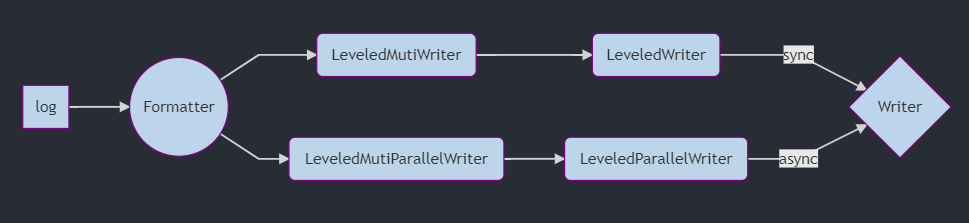
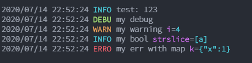

# `nlog` logger

`nlog` is a GoLang library for performant logging.

- Easy config, easy API
- Support multiple formatters
  - Console formatter(colored)
  - JSON formatter
- Different `io.Writer` stream wrappers
  - Simultaneous logging to multiple writes(via channels) concurrently
  - Async logging to multiple writes(via channels) concurrently
    - Writes multiple writers in parellel with buffered channel
- Includes `syslog` writer(wrapped around standard syslog for correct logging levels)
- Contextual logging
  - Allows data to be added to log messages in the form of key:value pairs
- Structured logging
  - Logs with levels
- Minimal memory allocs
- No dependencies
- `Hook` support
- But you can bring your own `json encoder` for serializing objects and define it for a formatter
- No reflection for high performance
- Includes `file rotater` log writer with compress support
- Has a loader from `yaml` formatted config file
- Sub logger support

## Logging concept



- Writer is after formatter, so for `nlog` will not build format message for each writer. It will build format only once and use it in all writers assigned to it.
- You can assign logging level for your formatter. If user log level is too detail, formatter will not format message and will not log it.
- `nlog` Internally uses buffer pool for low allocation.

## Benchmarks

Some benchmark data

```bash
goos: linux
goarch: amd64
pkg: github.com/derkan/nlog/log
BenchmarkInfof-4         2206740               538 ns/op             123 B/op          1 allocs/op
BenchmarkStr-4           1505314               803 ns/op             216 B/op          1 allocs/op
BenchmarkWith-4          1453686               798 ns/op             223 B/op          1 allocs/op
```

## Quick start

```go
package main

import "github.com/derkan/nlog/log"

func main(){
    log.Infof("test: %d", 123)
    log.Info().Str("a", "string").Msg(`str "key" test`)
}
```

And you'll get logs on console:

```text
2020/07/14 22:04:24 INFO test: 123
2020/07/14 22:04:24 INFO str "key" test a=string
```

If you want color init logger with your options:

```go
package main

import (
    "github.com/derkan/nlog/log"
    "github.com/derkan/nlog/log/formatter/console"
)

func main() {
    log.Init(
        log.WithFormatter(
            console.NewFormatter(
                console.WithColor(),
                console.WithDate(),
                console.WithTime(),
            )),
    )
    log.Infof("test: %d", 123)
    log.Debug().Str("a", "string").Msg("my debug")
    log.Warn().Int("i", 4).Msg("my warning")
    log.Info().Bool("b", true).Strs("strslice", []string{"a"}).Msg("my bool")
    log.Error().Err(nil).With("k", map[string]int{"x": 1}).Msg("my err with map")
}
```

You'll get colored output:



## Installation

```bash
go get -u github.com/derkan/nlog
```

## Formatters

Formatters are used to format log message according to your needs.

### Console Formatter

Console formatter is used to print plain logs to given `io.WriteCloser`.

| Option       | Default     | Description                       |
| ------------ | ----------- | --------------------------------- |
| `WithColor`  | `false`     | When enabled, prints colored logs |
| `WithWriter` | `os.Stdout` | Where to log messages             |

## TODO

- Documentation
- Tests
- Bechmarks
