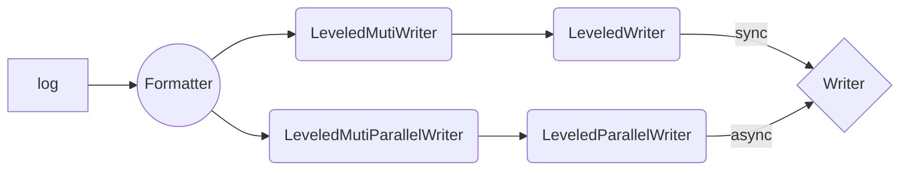

# Concept

```mermaid
graph LR
    A[log] --> B((Formatter)) --> C(LeveledMutiWriter)
    C --> D(LeveledWriter) -- sync --> E{Writer}
    B --> F(LeveledMutiParallelWriter) --> G(LeveledParallelWriter)
    G -- async --> E
```